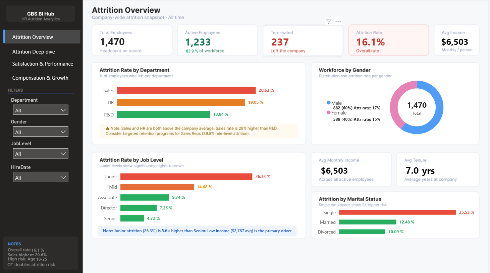
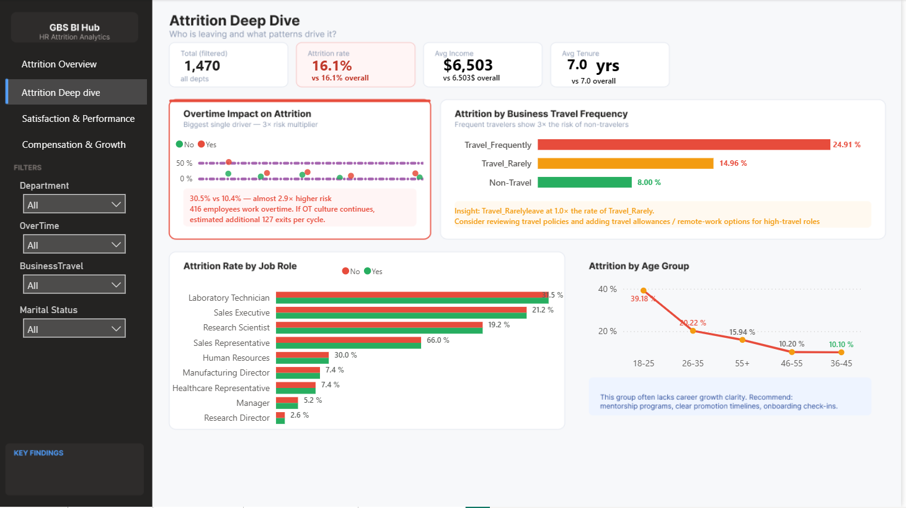
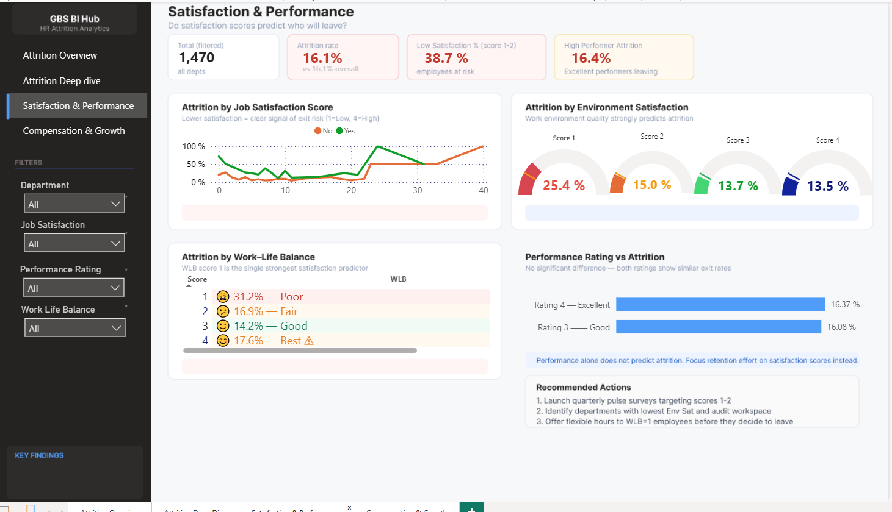
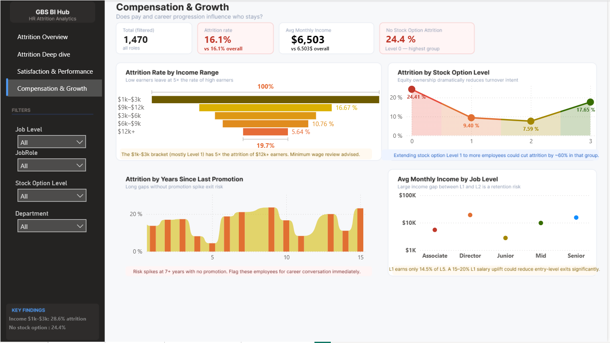

# HR Attrition Analytics Dashboard 🔍

An interactive 4-page Power BI dashboard analyzing employee 
attrition patterns across 1,470 employees.

---

## Dashboard Preview

### Page 1 — Attrition Overview

### Page 2 — Attrition Deep Dive

### Page 3 — Satisfaction & Performance

### Page 4 — Compensation & Growth

---

## Dashboard Pages

| Page | Focus |
|------|-------|
| Attrition Overview | Executive KPIs, dept & job level breakdown |
| Attrition Deep Dive | Overtime, travel, age group & job role analysis |
| Satisfaction & Performance | WLB, job satisfaction, environment scores |
| Compensation & Growth | Income ranges, stock options, promotion gaps |

## Key Findings

- **Overtime** → 30.5% attrition vs 10.4% with no OT (3× risk)
- **Sales Rep** → Highest role attrition at 39.8%
- **Age 18–25** → 35.8% — most at-risk age group
- **No Stock Option** → 24.4% vs 7.6% at Level 2
- **WLB Score 1** → 31.2% attrition — 2.2× riskier than Score 3
- **Low Income ($1k–$3k)** → 28.6% attrition vs 5.6% for $12k+

## Technical Details

- **Data Modeling:** Star Schema (Fact_Attrition + 4 Dim tables)
- **DAX Measures:** 15+ dynamic measures including automated 
  insight text, conditional formatting, and context-aware KPIs
- **Design:** Custom sidebar navigation, color-coded risk zones, 
  dynamic insight cards that update with every filter change

## Tools Used

`Power BI Desktop` `DAX` `Power Query` `Star Schema`

## Dataset

IBM HR Analytics Employee Attrition dataset — 1,470 employees,
35 attributes including satisfaction scores, compensation, 
performance ratings, and demographic data.
